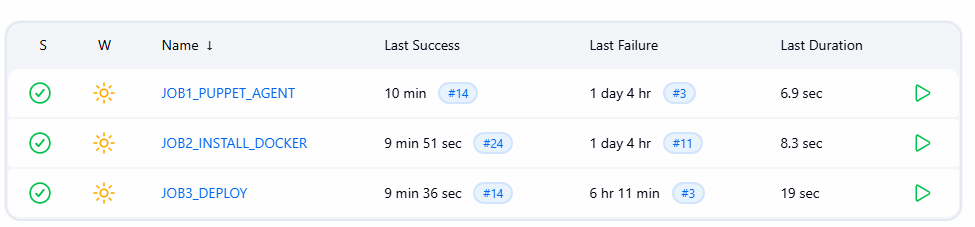
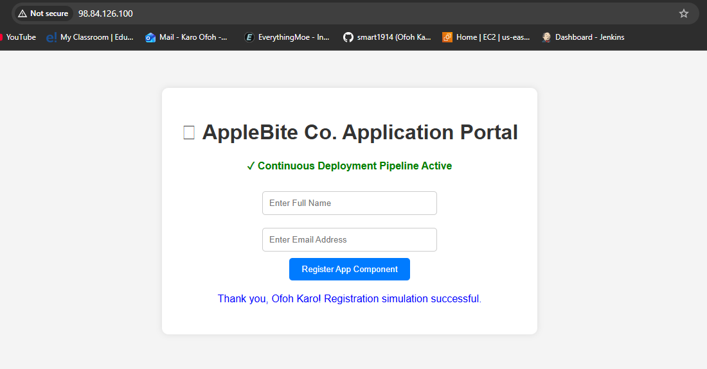

# Multi-Node Automated CI/CD Deployment Pipeline (AppleBite Co. Project)

A robust, three-stage continuous integration and continuous deployment (CI/CD) pipeline that automates configuration management, environment provisioning, and containerized application deployment across a multi-node AWS infrastructure.

## 🚀 Architecture Overview
This project demonstrates a production-grade DevOps workflow separating architectural concerns across a Master-Worker topology:
* **Source Control Management (SCM):** GitHub (Webhooks configured for automated triggers)
* **Orchestration Server (Master-VM):** Jenkins CI/CD Engine
* **Configuration Management:** Puppet Agent/Master setup for state enforcement
* **Container Runtime Environment:** Docker microservices isolation
* **Target Deployment Environment (Slave-Node):** Production Web Server

---

## 🛠️ Pipeline Workflow & Infrastructure Stages

### Stage 1: Configuration Management (JOB1_PUPPET_AGENT)
* Enforces system-level state configurations across the infrastructure.
* Automates package updates, security baselines, and node dependencies.

### Stage 2: Runtime Provisioning (JOB2_INSTALL_DOCKER)
* Dynamically verifies and installs Docker engines on the target Slave Node.
* Ensures clean environment dependencies without manual intervention.

### Stage 3: Immutable Deployment (JOB3_DEPLOY)
* Orchestrates automated SSH execution onto the deployment target node.
* Pulls latest application source code natively into workspace targets.
* Builds an immutable Docker image utilizing an optimized foreground Apache/PHP multi-stage strategy.
* Tears down legacy container overrides safely to enforce zero-downtime microservice lifecycles.

---

## 🐳 Docker Configuration (`Dockerfile`)
The deployment utilizes a hardened base image optimized to eliminate zombie terminal processes and directory pathing deadlocks:
```dockerfile
FROM devopsedu/webapp
RUN rm -rf /var/www/html/*
COPY index.php /var/www/html/index.php
CMD ["apachectl", "-D", "FOREGROUND"]




